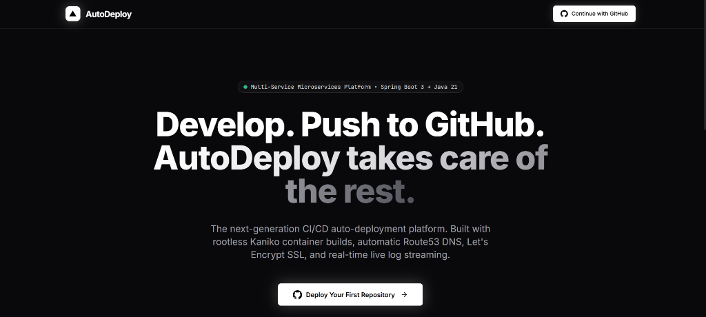

<div align="center">

# ⚡ AutoDeploy Platform

**The Next-Generation CI/CD Auto-Deployment Platform**

*Deploy modern web applications, microservices, and static sites seamlessly directly from your GitHub repositories.*

[](https://adoptium.net/)
[](https://spring.io/projects/spring-boot)
[](https://reactjs.org/)
[](https://vitejs.dev/)
[](https://www.docker.com/)
[](https://www.postgresql.org/)
[](https://www.rabbitmq.com/)
[](https://redis.io/)
[](https://traefik.io/)

<br/>



</div>

---

## 📖 About The Project

**AutoDeploy** is a full-stack, developer-first Cloud PaaS (Platform as a Service) inspired by platforms like **Vercel**, **Render**, and **Coolify**. 

Built from the ground up with **Java 21**, **Spring Boot 3 microservices**, and a high-performance **React + Vite** frontend, AutoDeploy streamlines the software release lifecycle:

1. **Connect**: Log in securely using **GitHub OAuth2** and pick any public or private repository.
2. **Configure**: Select target branches, customize build scripts, and securely inject AES-256 encrypted environment variables.
3. **Build & Package**: Isolated, rootless **Kaniko** container builders compile and package your application without Docker-in-Docker security risks.
4. **Deploy & Stream**: Live build logs stream in real-time to your browser via Server-Sent Events (SSE) while **Traefik v3** orchestrates zero-downtime routing and SSL provisioning.

---

## ✨ Key Features

- 🐙 **GitHub Native Integration**: One-click authentication with GitHub OAuth2, repository browsing, branch auto-discovery, and commit tracking.
- 📺 **Real-Time Live Log Streaming**: Watch compilation, AST bundling, container packaging, and health-check execution live via Server-Sent Events (SSE).
- 🔒 **Enterprise-Grade Security**: Environment secrets and GitHub access tokens are encrypted at rest using **AES-256-GCM**.
- 🛡️ **Rootless Container Builds**: Isolated **Google Kaniko** builders execute arbitrary build commands securely without granting root privileges or Docker daemon socket exposure.
- 🌐 **Dynamic Edge Routing**: Automatic reverse proxy route creation and subdomain assignment powered by **Traefik v3**.
- 🔄 **Instant Rollbacks & Redeploys**: Rollback to any previous deployment with single-click zero-downtime container switching.
- ⚡ **Event-Driven Architecture**: Fully asynchronous job queues driven by **RabbitMQ** and **Redis Pub/Sub**.

---

## 🏗️ Architecture Overview

```
┌───────────────────────────────────────────────────────────────────────────┐
│                           Frontend (React 18 + Vite)                      │
│                  Dark Mode UI · Live Log Stream · Real-Time UI            │
└─────────────────────────────────────┬─────────────────────────────────────┘
                                      │ HTTP / SSE / REST
                                      ▼
┌───────────────────────────────────────────────────────────────────────────┐
│                            API Gateway (:9090)                            │
│           Spring Cloud Gateway · JWT Auth Filter · Rate Limiting          │
└─────────┬──────────────┬──────────────┬──────────────┬─────────────┬──────┘
          │              │              │              │             │
          ▼              ▼              ▼              ▼             ▼
      Auth Svc      Project Svc     Build Svc     Deploy Svc    Domain Svc
       (:8081)        (:8082)        (:8083)        (:8084)       (:8085)
          │              │              │              │             │
          └──────────────┴──────┬───────┴──────────────┴─────────────┘
                                │
                      ┌─────────┴─────────┐
                      │   Eureka Registry │  Service Discovery (:8761)
                      └───────────────────┘
                                │
               ┌────────────────┼────────────────┐
               ▼                ▼                ▼
          PostgreSQL          Redis           RabbitMQ
         (6 Databases)      (Pub/Sub)       (Async Jobs)
```

---

## 🧩 Microservices & Service Ports

| Service | Port | Description | Tech Stack |
|:---|:---:|:---|:---|
| **`api-gateway`** | `9090` | Gateway entrypoint, JWT verification, rate limiting | Spring Cloud Gateway, WebFlux |
| **`discovery-service`** | `8761` | Microservice service registry and health discovery | Netflix Eureka Server |
| **`auth-service`** | `8081` | GitHub OAuth2 authorization, JWT generation | Spring Security, OAuth2 Client |
| **`project-service`** | `8082` | Repository management, project configuration | Spring Data JPA, PostgreSQL |
| **`build-service`** | `8083` | Rootless Kaniko build runner, SSE log streaming | Spring Boot, Kaniko, ECR |
| **`deployment-service`** | `8084` | Container lifecycle, status orchestration, rollbacks | Spring Boot, Docker Engine |
| **`domain-service`** | `8085` | Subdomain provisioning and DNS verification | Spring Boot, Route53, ACME |
| **`notification-service`**| `8086` | Real-time notification distribution and alerts | Spring WebSocket, STOMP |
| **`frontend`** | `3000` | Modern responsive web management console | React 18, Vite, Tailwind CSS |
| **Traefik Proxy** | `80` / `8080` | Edge reverse proxy & Traefik management dashboard | Traefik v3 |
| **RabbitMQ UI** | `15672` | Message queue management console | RabbitMQ Management |

---

## 🚀 Quick Start (Local Setup)

### 1. Prerequisites
- **Java 21** ([Eclipse Temurin Recommended](https://adoptium.net/))
- **Maven 3.9+**
- **Node.js 18+** & **npm**
- **Docker** & **Docker Compose**

### 2. Environment Configuration
Clone the repository and copy the environment template:
```bash
git clone https://github.com/Mihir072/autodeploy.git
cd autodeploy
cp .env.example .env
```

Open `.env` and fill in your GitHub OAuth App credentials:
```env
GITHUB_CLIENT_ID=your_github_oauth_client_id
GITHUB_CLIENT_SECRET=your_github_oauth_client_secret
JWT_SECRET=your_512_bit_generated_jwt_secret_key
AES_ENCRYPTION_KEY=your_256_bit_generated_encryption_key
```

### 3. Start Infrastructure & Backend Services (Docker Compose)
To start the entire platform stack (Postgres, Redis, RabbitMQ, Traefik, and all microservices):
```bash
# Build all backend service JARs
mvn clean package -DskipTests

# Launch all containers
docker compose up -d
```

### 4. Start Frontend Development Server
In a separate terminal, launch the React client:
```bash
cd frontend
npm install
npm run dev
```

The frontend dashboard will be available at **[http://localhost:3000](http://localhost:3000)**.

---

## 📁 Repository Structure

```
Auto Deploy/
├── api-gateway/              # Spring Cloud Gateway (Port 9090)
├── auth-service/             # GitHub OAuth2 & JWT tokens (Port 8081)
├── build-service/            # Kaniko build execution & SSE log streamer (Port 8083)
├── common/                   # Shared DTOs, AES-256 encryption, security utilities
├── deployment-service/       # Container deployer & rollbacks (Port 8084)
├── discovery-service/        # Eureka Service Registry (Port 8761)
├── domain-service/           # Custom domain verification & DNS (Port 8085)
├── notification-service/     # WebSockets & email alert distributor (Port 8086)
├── frontend/                 # React 18 + Vite + Tailwind CSS dashboard UI
├── postgres-init/            # Automated SQL schemas for all 6 microservice databases
├── docs/                     # Documentation & UI asset previews
├── docker-compose.yml        # Full-stack Docker compose configuration
├── docker-compose.infra.yml  # Infrastructure-only compose (Postgres, Redis, RabbitMQ)
└── pom.xml                   # Multi-module Maven root POM
```

---

## 🔐 Security & Reliability

- **Secret Protection**: All project environment variables and user OAuth access tokens are encrypted with **AES-256-GCM** before database persistence.
- **Gateway Authentication**: High-speed JWT validation at the API Gateway edge with distributed Redis rate limiting (20 requests/sec per user).
- **Zero Socket Exposure**: Builds run in rootless, sandboxed Kaniko containers preventing unauthorized access to the host's Docker socket.

---

## 🤝 Contributing

Contributions, issues, and feature requests are welcome! Feel free to check the [issues page](https://github.com/Mihir072/autodeploy/issues).

---

## 📄 License

This project is licensed under the MIT License - see the [LICENSE](LICENSE) file for details.
